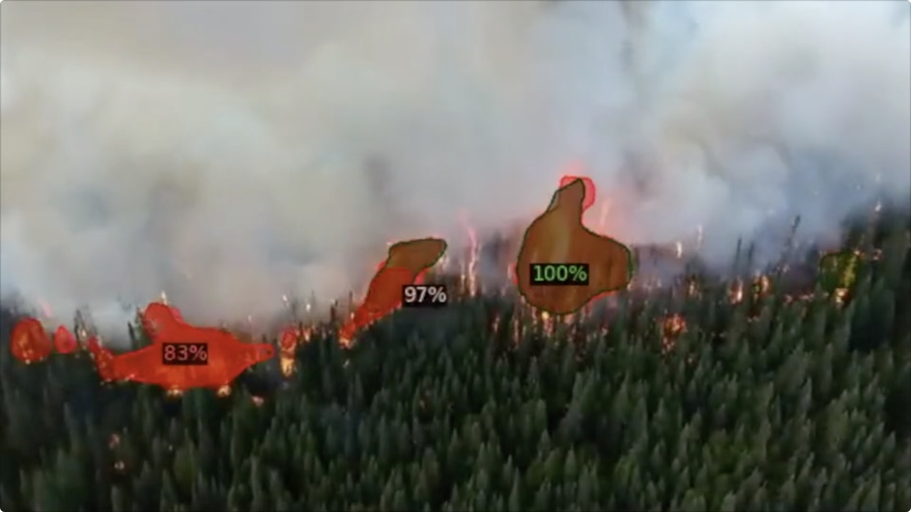
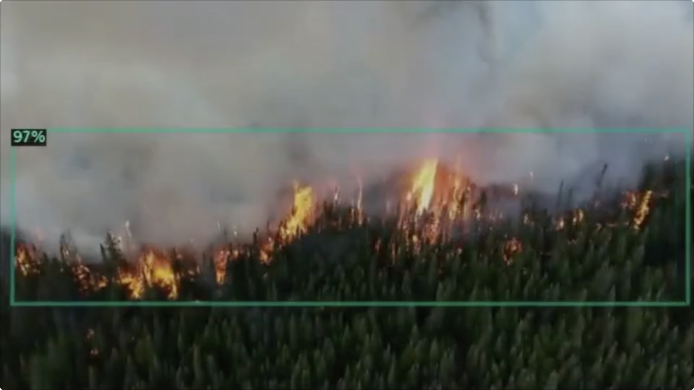

# Wildfire-AI
## Install
Wildfire-AI is a wildfire detector based on the Mask-RCNN architecture implemented in detectron2. Run the following to install detectron2
```
pip install detectron2 -f https://dl.fbaipublicfiles.com/detectron2/wheels/cu101/torch1.6/index.html
```
Also, clone the detectron2 repo for video inference, or use the `VidFrameInference.py` file in `\WildfireAI` which is less efficient
```
git clone https://github.com/facebookresearch/detectron2
```

## WildfireAI
With Segmentation |  Bounding Box Only
:-------------------------:|:-------------------------:
  |  
